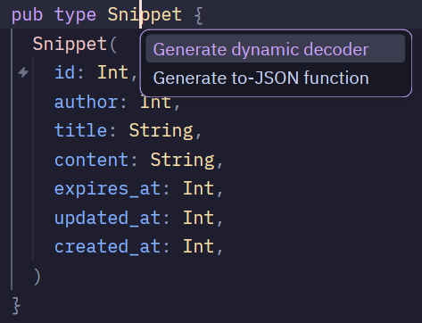

# Encoding and Decoding JSON

### JSON Encoding

In order to turn Gleam types like string and int into JSON, we need to write an encoder. You may not notice it, but we've been doing this when we write the health handler.

```gleam
// server/src/server/routes/health.gleam

pub fn health() -> Response {
  json.object([#("status", json.string("available"))]) // we turn Gleam string type into JSON type
  |> json.to_string
  |> wisp.json_response(200)
}
```

Doing this for only a couple of strings is fine, but if we have a lot, doing it inside the handler like this will bloat the function. To clean up the function, we're going to separate the encoding part into an encoder function.

Because we might use the decoder and encoder for various data type in both the server and client, let's put it in a shared folder. Run `cd ~/Projects/pastem && gleam new shared && cd shared`. Inside `shared.gleam`, write:

```gleam
// shared/src/shared.gleam
pub type Snippet {
  Snippet(
    id: Int,
    author: Int,
    title: String,
    content: String,
    expires_at: Int,
    updated_at: Int,
    created_at: Int,
  )
}

// Turn Gleam types into JSON
pub fn snippet_to_json(snippet: Snippet) -> json.Json {
  let Snippet(
    id:,
    author:,
    title:,
    content:,
    expires_at:,
    updated_at:,
    created_at:,
  ) = snippet
  json.object([
    #("id", json.int(id)),
    #("author", json.int(author)),
    #("title", json.string(title)),
    #("content", json.string(content)),
    #("expires_at", json.int(expires_at)),
    #("updated_at", json.int(updated_at)),
    #("created_at", json.int(created_at)),
  ])
}
```

### Decoding JSON

We just wrote our snippet data as Gleam types and create function to turn it into JSON. Now let's see how we would decode JSON into Gleam types.

```gleam
// Turn JSON into Gleam types
fn snippet_decoder() -> decode.Decoder(Snippet) {
  use id <- decode.field("id", decode.int)
  use author <- decode.field("author", decode.int)
  use title <- decode.field("title", decode.string)
  use content <- decode.field("content", decode.string)
  use expires_at <- decode.field("expires_at", decode.int)
  use updated_at <- decode.field("updated_at", decode.int)
  use created_at <- decode.field("created_at", decode.int)
  decode.success(Snippet(id:, author:, title:, content:, expires_at:, updated_at:, created_at:))
}
```

### Code Action

That's a lot of typing! Don't worry, you can use code action of your code editor to automatically write the encoder. In Zed, place your cursor on the type and press \[Ctrl + .], a popup will appear. For other code editor, refer to your code editor's documentation.

<figure><figcaption><p>Gleam LSP Code Action</p></figcaption></figure>

### Further Reading

* Gleam Language Server docs: [https://gleam.run/language-server/](https://gleam.run/language-server/)
